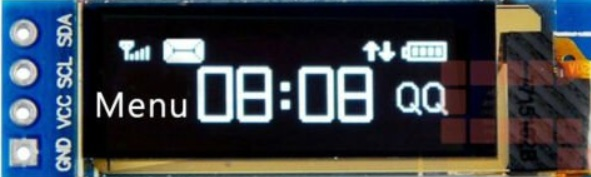

# Pantallas
## Pantalla Display Oled 0.91 Pulgadas Azul 128×32
Pantalla OLED, sin necesidad de retroiluminación, autoiluminación, el rendimiento de la pantalla es mejor que la pantalla LCD tradicional, también menor consumo.

